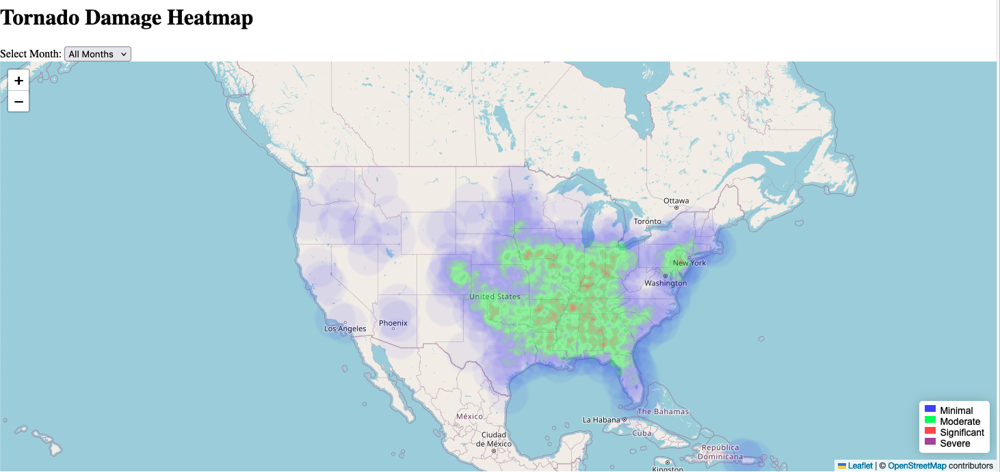
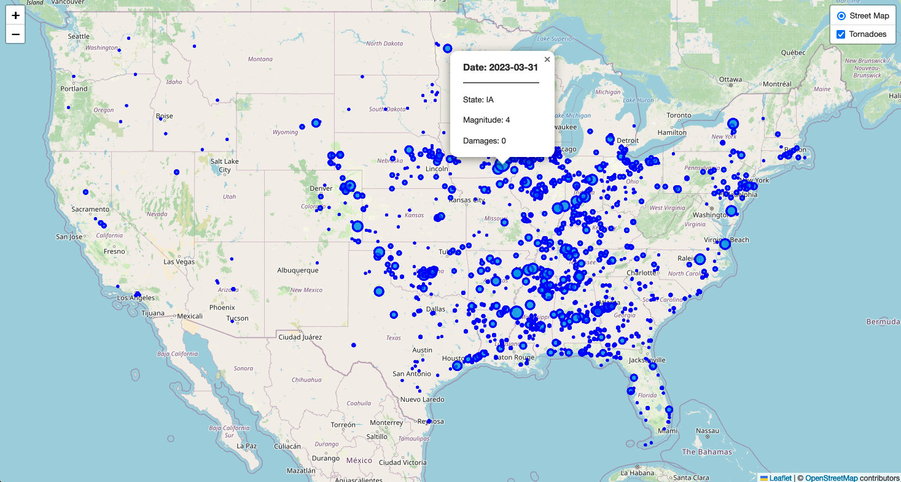

# Project3
## Project Overview and Purpose
As global warming becomes and increasingly looming threat, severe weather events are on the rise. To identify areas in the country where tornadoes are more frequent and more damaging, we created a website that shows various charts and maps of tornado data in the United States from 2023.

## How to Use/Interact with Project
Users hit our main webpage and are shown links to the various views of the tornado data that we created. The website is meant to be intuitive for users and should not require instructions. 

For developers, first you will need to import our tornado data into your local MongoDB server (see Mongo Setup.ipynb for command setup and testing). Next you need to run the Flask server in the environment where MongoDB is running (python app.py). Your Terminal or GitBash will direct you to the URL where the site is hosted.

Here are some of the visualizations users and developers should see when engaging with the site:

Tornado Counts by Day:

Tornado Counts by Month:

Tornado Damages:

Tornado Magnitudes:

## Ethical Considerations
We chose ethically sourced data that is not copyrighted and is free for public use. Due to the non-proprietary nature of the data, there is no issue with us displaying this data in any form. We may want to take into consideration the emotional implications of showing this data—we are not interested in scare tactics. This is purely educational.

## Data Source
Data source can be found on the Storm Prediction Center [site](https://www.spc.noaa.gov/wcm/#data).

## Code References
- [Flask](https://flask.palletsprojects.com/en/3.0.x/)
- [PyMongo](https://pymongo.readthedocs.io/en/stable/)
- [Flask with MongoDB](https://www.mongodb.com/resources/products/compatibilities/setting-up-flask-with-mongodb)
- [Leaflet.js](https://leafletjs.com/)
- [Turf.js](https://turfjs.org/)
- [Turf.js with Leaflet.js](https://stackoverflow.com/questions/65320098/using-turf-with-leaflet)
- [JavaScript with Flask API](https://realpython.com/flask-javascript-frontend-for-rest-api/)
- [HTML](https://www.w3schools.com/html/default.asp)
